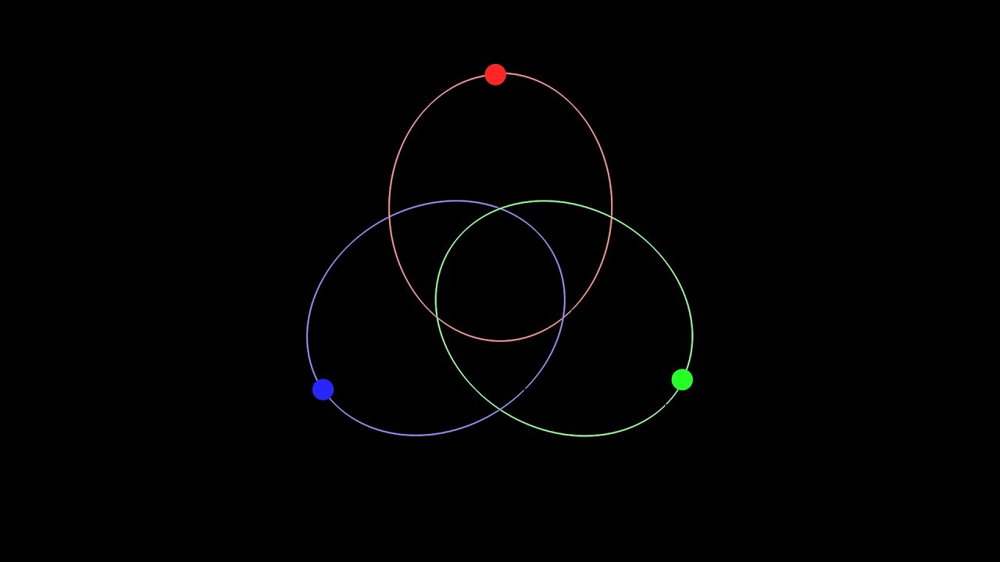

# N-body simulation 1.0.0

The current version is a simple planetary model (Not to scale) simulation which tries to mimic the real world. It is the C++ raylib version of Tech with Tims python model.
Im planning to expand it in a future release where simulations of n-body systems with arbitary locations can be produced.

> make game
 
> ./game
 

If youre having problems running the build task within vscode make sure the makefile extension is installed!

---
 

  

---
## Python version
https://www.youtube.com/watch?v=WTLPmUHTPqo  
https://github.com/Sheane-mario/solar-system-simulation 

